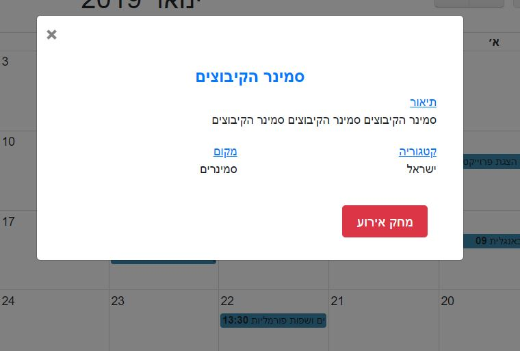

# HashtagCal Project Group 20 [#cal](http://hashtagcal.com)
> This project displays a calendar web site

<a href="https://www.npmjs.com/" rel="nofollow"></a>
<a href="https://nodejs.org/en/" rel="nofollow"></a>
<a href="https://travis-ci.org/expressjs/express" rel="nofollow"></a>

An amazing calendar that offers options such as:<br>
Register / Login to the site which includes 3 user types<br>
Manage user events in daily / monthly view<br>
Issuing user reports<br>
Grant permissions to a calendar for another user<br>
Managing a global calendar by editors (user type)<br>
Issuing content editor reports<br>
Manage manager requests to register / edit events<br>
Issuing Manager Reports<br>
Editing users<br>
And more ...


## Installation

Backend:

```sh
bcrypt: ^3.0.3
body-parser: ^1.18.3
cors: ^2.8.5
express: ^4.16.4
express-validator: ^5.3.0
jsonwebtoken: ^8.4.0
mongoose: ^5.3.13
```

Frontend-CSS:
```sh
Bootstrap: ^4.0.0
FullCalendar: ^3.9.0
jQuery UI: ^1.12.1
toastr: ^2.1.4
```

Frontend-JS:
```sh
bootbox: ^4.4.0
Bootstrap: ^4.1.3
FullCalendar: ^3.9.0
jQuery: ^1.12.4
jQuery UI: ^1.12.1
popper: ^1.14.3
moment: ^2.0.0
toastr: ^2.1.4
```


## Usage example




_For more examples and usage, just scroll down._

## Development setup

this site run over linux server with nodeJS web server over express configuration

step 1:<br>
server install before start:<br>
install Apache2 server [Apache2](https://www.digitalocean.com/community/tutorials/how-to-install-the-apache-web-server-on-ubuntu-18-04).<br>
install nodeJS server [nodeJS](https://www.digitalocean.com/community/tutorials/how-to-set-up-a-node-js-application-for-production-on-ubuntu-18-04).<br>
install mongoDB server [mongoDB](https://www.digitalocean.com/community/tutorials/how-to-install-mongodb-on-ubuntu-18-04).<br>

step 2:<br>
change configurations in code:
```
calServ/config/index.js
    search:
        return 'mongodb://' + deployEnviroment.uname + ':' + deployEnviroment.pwd + "@ds117334.mlab.com:17334/calendarproject";
    replace:
        return 'mongodb://' + deployEnviroment.uname + ':' + deployEnviroment.pwd + "'your link to DB with port listening'";
calServ/config/config.json
    search:
        "uname": "deanz",
        "pwd": "D305622375m",    
    replace:
        "uname": "'your username to DB'",
        "pwd": "'your password to DB",
js/canActivate.js
    search:
            let url='http://104.248.95.224:3000';   
        replace:
            let url='your server ip:port (node port)';
```
step 3:<br>
upload files:
```
upload calServ folder to root folder in server
upload main folter to apache2 filder in 'var/www/html'
```

step 4:<br>
run as root:
```
cd ~
$ npm install -global
```

step 5:<br>
run the service:
```
option 1: (save the service running on default)
    $ npm install pm2 -g
    $ pm2 start calServ/app.js
option 1: (regular running)
    $ node app.js
```


## Development unit test
run as root:
```
$ cd ~
$ cd root/calServ
$ npm test
```

## Meta

Dor Shoshan – [@facebook](https://www.facebook.com/shoshan2) – email: dorsh3@ac.sce.ac.il <br>
Dean Abutbul – [@facebook](https://www.facebook.com/profile.php?id=100017200627018) – email: deanab@ac.sce.ac.il <br>
Ofek Talker – [@facebook](https://www.facebook.com/ofek.talker.3) – email: mailto:ofekta1@ac.sce.ac.il <br>
Eden Ohana – [@facebook](https://www.facebook.com/eden.ohana.94) – email: edenoh2@ac.sce.ac.il <br>

[git Link](https://github.com/DeanSami/calProject/tree/dor)

## Images


